{0}------------------------------------------------

# **Lecture 3**

E V E R Y T H I N G Y O U D I D N' T WA N T T O K N O W A B O U T L M A R C H I T E C T U R E A N D H Y P E R PA R A M E T E R S

CS336

Tatsu H

{1}------------------------------------------------

## **Outline and goals**

❖ Quick recap of a modern transformer (what you implement)

❖ What do most of the large LMs have in common?

❖ What are common variations to the architecture / training process?

**Today's theme:** the best way to learn is hands-on experience the second best way is to try to learn from others' experience

{2}------------------------------------------------

## **Starting point: the 'original' transformer**

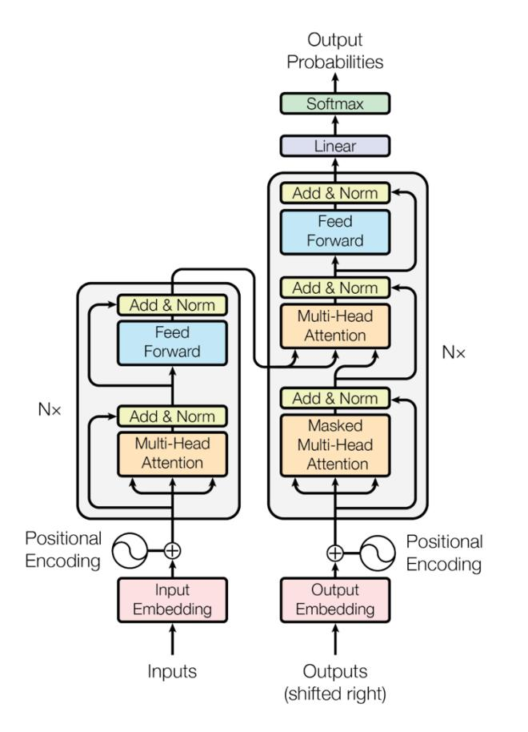

**Review:** choices in the standard transformer

**Position embedding:** sines and cosines

$$PE_{(pos,2i)} = sin(pos/10000^{2i/d_{\rm model}}) \ PE_{(pos,2i+1)} = cos(pos/10000^{2i/d_{\rm model}})$$

**FFN:** ReLU

$$FFN(x) = \max(0, xW_1 + b_1)W_2 + b_2$$

**Norm type:** post-norm, LayerNorm

{3}------------------------------------------------

## **What you implemented – simple, modern variant**


#### **Differences:**

- **LayerNorm** is in front of the block
- **Rotary position embeddings (RoPE)**
- FF layers use **SwiGLU**, not ReLU
- Linear layers (and layernorm) have **no bias** (constant) terms

**Why did we pick these? What should you pick?**

{4}------------------------------------------------

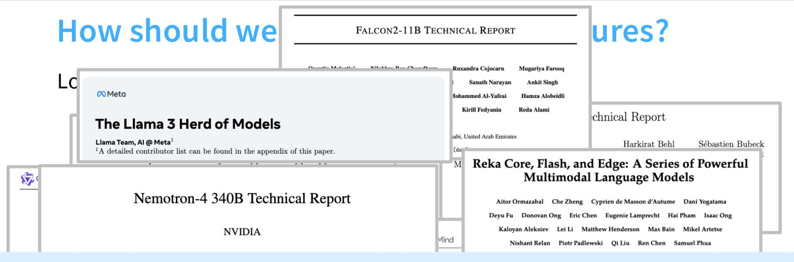

#### Over 19 new *dense* model releases, many of them with minor architecture tweaks..

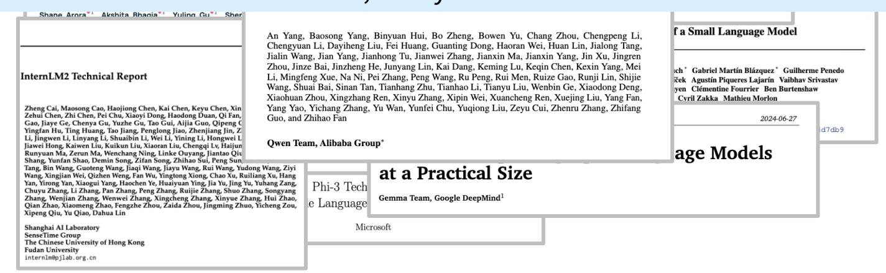

{5}------------------------------------------------


{6}------------------------------------------------

## **Let's look at the data (on dense architectures)**

Learn from the many other models (and papers) out there

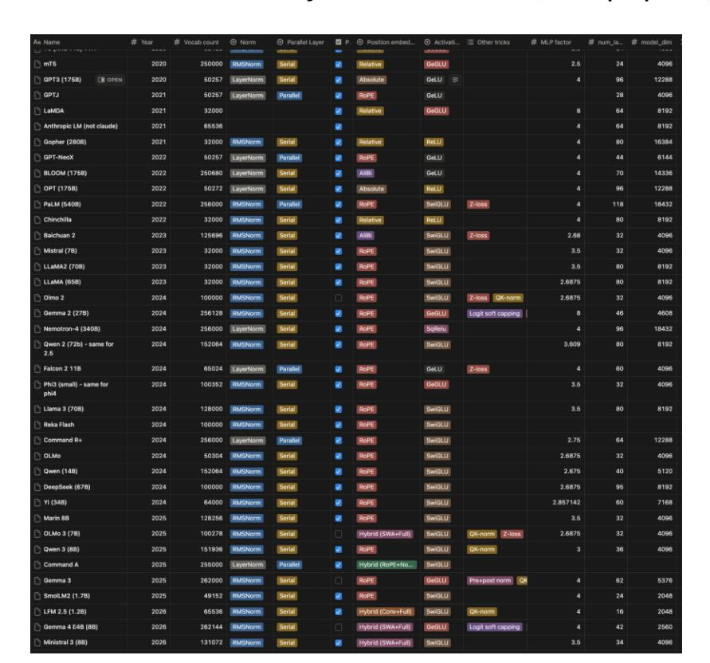

**We will talk through many major architecture and hyperparameter variants.** 

- What do all these models have in common?
- What parts vary?
- What can we learn from this?

{7}------------------------------------------------

## **What are we going to cover?**

#### **Common architecture variations**

- Activations, FFN
- Attention variants
- Position embeddings

#### **Hyperparameters that (do or don't) matter**

- What is ff\_dim? Do multi\_head dims always sum to model\_dim?
- How many vocab elements?

#### **Stability tricks**

{8}------------------------------------------------

## **Architecture variations..**

Let's think about the core architecture piece

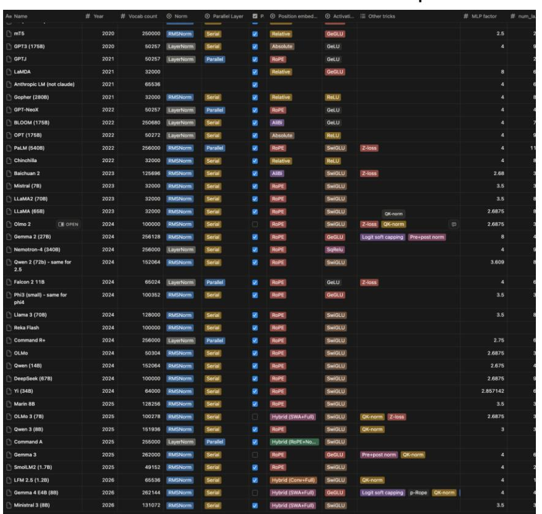

#### **High level view:**

- Dominance of 'LLaMAlike' architectures
- Trends over the years (QK-norm, Hybrid attention)

{9}------------------------------------------------

## **Pre-vs-post norm**

The one thing *everyone* agrees on (in 2024)

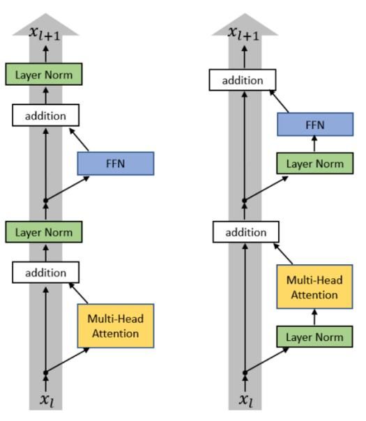

| Figure from Xiong | 2020 |
|-------------------|------|
|-------------------|------|

| Post-LN Transformer                                                                                                                                                          | Pre-LN Transformer                                                                                                                                                                                          |
|------------------------------------------------------------------------------------------------------------------------------------------------------------------------------|-------------------------------------------------------------------------------------------------------------------------------------------------------------------------------------------------------------|
|                                                                                                                                                                              | $ \begin{aligned} x_{l,i}^{pre,1} &= \operatorname{LayerNorm}(x_{l,i}^{pre}) \\ x_{l,i}^{pre,2} &= \operatorname{MultiHeadAtt}(x_{l,i}^{pre,1}, [x_{l,1}^{pre,1}, \cdots, x_{l,n}^{pre,1}]) \end{aligned} $ |
| $ \begin{array}{l} z_{l,i}^{rost,3} = \text{LayerNorm}(x_{l,i}^{post,2}) \\ x_{l,i}^{post,4} = \text{ReLU}(x_{l,i}^{post,3}W^{1,l} + b^{1,l})W^{2,l} + b^{2,l} \end{array} $ | $x_{l,i}^{pre,3} = x_{l,i}^{pre} + x_{l,i}^{pre,2} \ x_{l,i}^{pre,3} = \text{LayerNorm}(x_{l,i}^{pre,3})$                                                                                                   |
| $x_{l,i}^{post,5} = x_{l,i}^{post,3} + x_{l,i}^{post,4}$                                                                                                                     | $x_{l,i}^{pre,5} = \text{ReLU}(x_{l,i}^{pre,4}W^{1,l} + b^{1,l})W^{2,l} + b^{2,l}$                                                                                                                          |
| $x_{l+1,i}^{post} = \text{LayerNorm}(x_{l,i}^{post,5})$                                                                                                                      | $\begin{aligned} x_{l+1,i}^{pre} &= x_{l,i}^{pre,5} + x_{l,i}^{pre,3} \\ &\text{Final LayerNorm: } x_{Final,i}^{pre} \leftarrow \text{LayerNorm}(x_{L+1,i}^{pre}) \end{aligned}$                            |

Set up LayerNorm so that it doesn't affect the main residual signal path (on the left)

#### **Almost all modern LMs use pre-norm (but BERT was post-norm)**

(One somewhat funny exception – OPT350M. I don't know why this is post-norm)

{10}------------------------------------------------

## **Pre-vs-post-norm, the data**

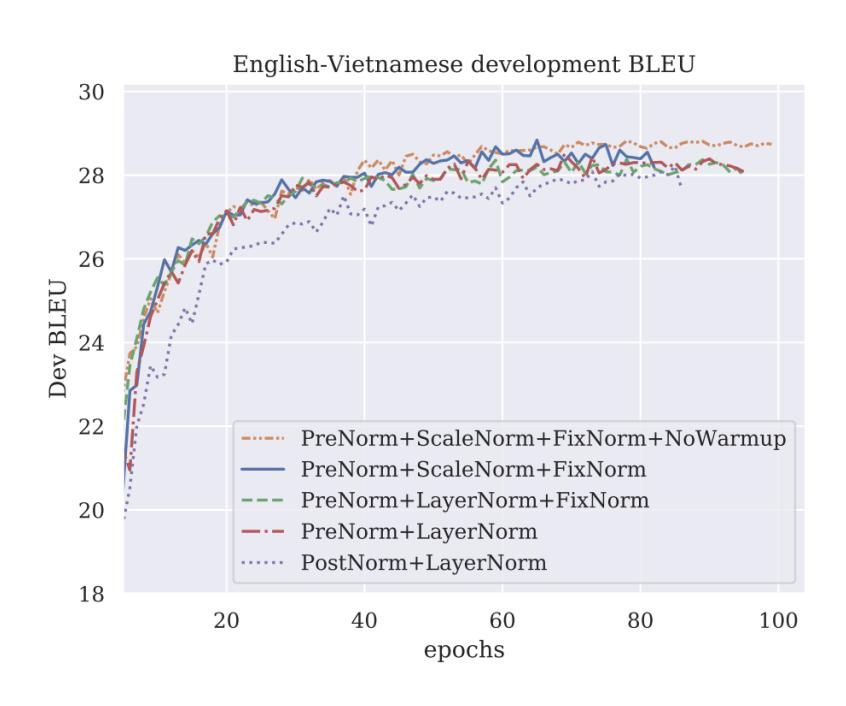

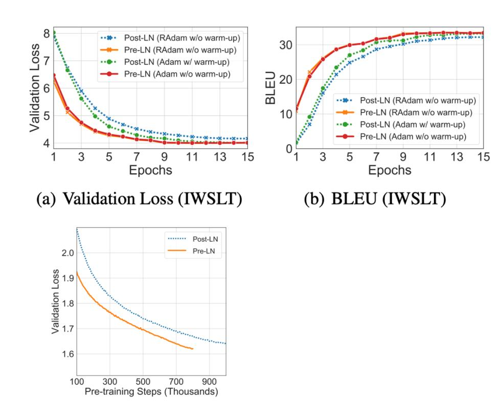

Figure from Xiong 2020 Salazar and Ngyuen 2019

{11}------------------------------------------------

## **Pre-vs-post norm, explanations?**

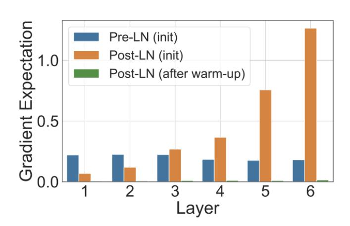

#### Gradient attenuation [Xiong 2020] Gradient spikes [Salazar and Ngyuen]

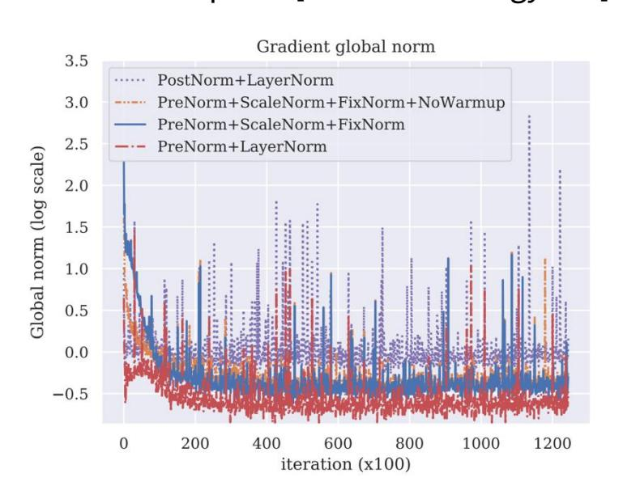

**Original stated advantage**– removing warmup. **Today** – stability and larger LRs for large networks

{12}------------------------------------------------

## **New things – 'double' norm or non-residual postnorm**

If putting LayerNorms in residual streams is bad.. Why not post-norm outside the stream?

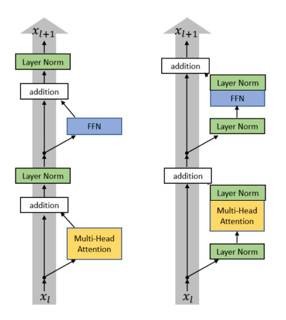

**Recent models:** Grok, Gemma 2. Olmo 2 *only* does non-residual post norm

{13}------------------------------------------------

## **LayerNorm vs RMSNorm**

Original transformer: **LayerNorm** – normalizes the mean and variance across

$$y = \frac{x - \mathrm{E}[x]}{\sqrt{\mathrm{Var}[x] + \epsilon}} * \gamma + \beta$$

Many modern LMs: **RMSNorm** – does not subtract mean or add a bias term

$$y = \frac{x}{\sqrt{||x||_2^2 + \varepsilon}} * \gamma$$

#### **Notable models:**

GPT3/2/1, OPT, GPT-J, BLOOM

#### **Notable models:**

LLaMA-family, PaLM, Chinchilla, T5

{14}------------------------------------------------

## **Why RMSNorm?**

**Modern explanation** – it's faster (and just as good).

- **Fewer operations** (no mean calculation)
- **Fewer parameters** (no bias term to store)

$$y = \frac{x - \mathrm{E}[x]}{\sqrt{\mathrm{Var}[x] + \epsilon}} * \gamma + \beta$$

#### **Does this explanation make sense?**

| Operator class                                            | % flop                |
|-----------------------------------------------------------|-----------------------|
| △ Tensor contraction □ Stat. normalization ○ Element-wise | 99.80<br>0.17<br>0.03 |

Matrix multiplies are the *vast* majority of FLOPs (and memory)

{15}------------------------------------------------

## **Why RMSNorm (2)**

**Important lesson:** FLOPS are not runtime! (we will discuss this in far more detail later)

| Operator class                   | % flop | % Runtime |
|----------------------------------|--------|-----------|
| △ Tensor contraction             | 99.80  | 61.0      |
| ☐ Stat. normalization            | 0.17   | 25.5      |
| <ul> <li>Element-wise</li> </ul> | 0.03   | 13.5      |

RMSNorm can still matter due to the importance of *data movement*

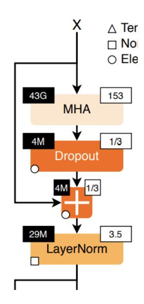

Left top ("43G") is FLOPS Right top ("153") is the FLOP-to-memory ratio

{16}------------------------------------------------

## **RMSNorm - validation**

**RMSNorm** runtime (and surprisingly, perf) gains have been seen in papers

| Model               | Params | $\mathbf{Ops}$ | Step/s | Early loss        | Final loss | SGLUE | XSum  | $\mathbf{WebQ}$ | WMT EnDe |
|---------------------|--------|----------------|--------|-------------------|------------|-------|-------|-----------------|----------|
| Vanilla Transformer | 223M   | 11.1T          | 3.50   | $2.182\pm0.005$   | 1.838      | 71.66 | 17.78 | 23.02           | 26.62    |
| RMS Norm            | 223M   | 11.1T          | 3.68   | $2.167 \pm 0.008$ | 1.821      | 75.45 | 17.94 | 24.07           | 27.14    |
| Rezero              | 223M   | 11.1T          | 3.51   | $2.262\pm0.003$   | 1.939      | 61.69 | 15.64 | 20.90           | 26.37    |
| Rezero + LayerNorm  | 223M   | 11.1T          | 3.26   | $2.223\pm0.006$   | 1.858      | 70.42 | 17.58 | 23.02           | 26.29    |
| Rezero + RMS Norm   | 223M   | 11.1T          | 3.34   | $2.221\pm0.009$   | 1.875      | 70.33 | 17.32 | 23.02           | 26.19    |
| Fixup               | 223M   | 11.1T          | 2.95   | $2.382\pm0.012$   | 2.067      | 58.56 | 14.42 | 23.02           | 26.31    |

{17}------------------------------------------------

## **More generally: dropping bias terms**

**Most modern transformers don't have bias terms.**

Original Transformer:

$$FFN(x) = \max(0, xW_1 + b_1)W_2 + b_2$$

Most implementations (if they're not gated):

$$FFN(x) = \sigma(xW_1)W_2$$

**Reasons:** memory (similar to RMSnorm) and optimization stability

{18}------------------------------------------------

## **LayerNorm: recap**

- Basically everyone does non-residual norm (often prenorm)
  - Intuition keep the good parts of residual connections
  - Observations nicer gradient propagation, fewer spike
  - Some people add a second norm outside the residual stream

#### • Most people do RMSnorm

- In practice, works as well as LayerNorm
- But, has fewer parameters to move around, which saves on wallclock time
- People more generally drop bias terms since the compute/param tradeoffs are not great.

{19}------------------------------------------------

## **Activations**

**A whole zoo of activations** ..

ReLU, GeLU, Swish, ELU, GLU, GeGLU, ReGLU, SeLU, SwiGLU, LiGLU

**What are these things? What do people use? Does it matter?**

{20}------------------------------------------------

## **A few of the common activations**

#### **ReLU**

$$FF(x) = \max(0, xW_1) W_2$$

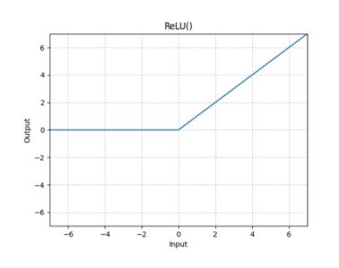

#### **Notable models:**

Original transformer, T5, Gopher, Chinchilla, OPT

#### **GeLU**

$$FF(x) = GELU(xW_1)W_2$$
  
 $GELU(x) := x\Phi(x)$ 

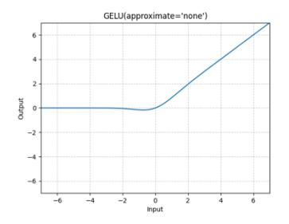

#### **Notable models:**

GPT1/2/3, GPTJ, GPT-Neox, BLOOM

#### **SwiGLU / GeGLU (next slide..)**

#### **Notable models:**

Llama, PaLM,T5 v1.1, *most* models post 2023

{21}------------------------------------------------

## **Gated activations (\*GLU)**

GLUs modify the 'first part' of a FF layer

$$FF(x) = \max(0, xW_1) W_2$$

Instead of a linear + ReLU, augment the above with an (entrywise) linear term

$$\max(0, xW_1) \to \max(0, xW_1) \otimes (xV)$$

This gives the gated variant (ReGLU) – note that we have an extra parameter (V)

$$FF_{ReGLU}(x) = (\max(0, xW_1) \otimes xV) W_2$$

{22}------------------------------------------------

## **Gated variants of standard FF layers**

#### **GeGLU**

## **SwiGLU** (swish is ∗ sigmoid())

**Notable models:**

T5 v1.1, mT5, LaMDA, Phi3, Gemma 2, Gemma 3, Gemma 4

#### **Notable models:**

LLaMa 1/2/3, PaLM, Mistral, OlMo, *most models post 2023*

Note: Gated models use smaller dimensions for the by 2/3

{23}------------------------------------------------

## **Do gated linear units work?**

Yes, fairly consistently so.

|                                       | Score   | CoLA  | SST-2 |
|---------------------------------------|---------|-------|-------|
|                                       | Average | MCC   | Acc   |
| $\overline{\text{FFN}_{\text{ReLU}}}$ | 83.80   | 51.32 | 94.04 |
| $\mathrm{FFN}_{\mathrm{GELU}}$        | 83.86   | 53.48 | 94.04 |
| $\mathrm{FFN}_{\mathrm{Swish}}$       | 83.60   | 49.79 | 93.69 |
| $\overline{\text{FFN}_{\text{GLU}}}$  | 84.20   | 49.16 | 94.27 |
| $\mathrm{FFN}_{\mathrm{GEGLU}}$       | 84.12   | 53.65 | 93.92 |
| $\mathrm{FFN}_{\mathrm{Bilinear}}$    | 83.79   | 51.02 | 94.38 |
| $\mathrm{FFN}_{\mathrm{SwiGLU}}$      | 84.36   | 51.59 | 93.92 |
| $\mathrm{FFN}_{\mathrm{ReGLU}}$       | 84.67   | 56.16 | 94.38 |
| [Raffel et al., 2019]                 | 83.28   | 53.84 | 92.68 |
| ibid. stddev.                         | 0.235   | 1.111 | 0.569 |

Shazeer 2020

{24}------------------------------------------------

## **Do gated linear units work (2)?**

Yes, with other works corroborating Shazeer 2020

| Model                  | Params | Ops   | Step/s | Early loss        | Final loss  | SGLUE                | XSum  | WebQ  |
|------------------------|--------|-------|--------|-------------------|-------------|----------------------|-------|-------|
| Vanilla Transformer    | 223M   | 11.1T | 3.50   | $2.182\pm0.005$   | 1.838       | 71.66                | 17.78 | 23.02 |
| GeLU                   | 223M   | 11.1T | 3.58   | $2.179 \pm 0.003$ | 1.838       | 75.79                | 17.86 | 25.13 |
| Swish                  | 223M   | 11.1T | 3.62   | $2.186\pm0.003$   | 1.847       | 73.77                | 17.74 | 24.34 |
| ELU                    | 223M   | 11.1T | 3.56   | $2.270\pm0.007$   | 1.932       | 67.83                | 16.73 | 23.02 |
| GLU                    | 223M   | 11.1T | 3.59   | $2.174 \pm 0.003$ | 1.814       | 74.20                | 17.42 | 24.34 |
| $\operatorname{GeGLU}$ | 223M   | 11.1T | 3.55   | $2.130 \pm 0.006$ | $\bf 1.792$ | 75.96                | 18.27 | 24.87 |
| $\operatorname{ReGLU}$ | 223M   | 11.1T | 3.57   | $2.145 \pm 0.004$ | 1.803       | 76.17                | 18.36 | 24.87 |
| $\operatorname{SeLU}$  | 223M   | 11.1T | 3.55   | $2.315 \pm 0.004$ | 1.948       | 68.76                | 16.76 | 22.75 |
| SwiGLU                 | 223M   | 11.1T | 3.53   | $2.127 \pm 0.003$ | 1.789       | 76.00                | 18.20 | 24.34 |
| LiGLU                  | 223M   | 11.1T | 3.59   | $2.149 \pm 0.005$ | 1.798       | 75.34                | 17.97 | 24.34 |
| Sigmoid                | 223M   | 11.1T | 3.63   | $2.291\pm0.019$   | 1.867       | 74.31                | 17.51 | 23.02 |
| Softplus               | 223M   | 11.1T | 3.47   | $2.207\pm0.011$   | 1.850       | $\boldsymbol{72.45}$ | 17.65 | 24.34 |

{25}------------------------------------------------

## **Gating, activations**

• **Many variations (ReLU, GeLU, \*GLU) across models.**

• **\*GLU isn't** *necessary* **for a working model (see GPT3), but it's rare to see others..**

Some outlier models..

Nemotron 340B (Squared ReLU)

• **Evidence points towards somewhat consistent gains from Swi/GeGLU**

{26}------------------------------------------------

## **Serial vs Parallel layers**

Normal transformer blocks are *serial* – they compute attention, then the MLP

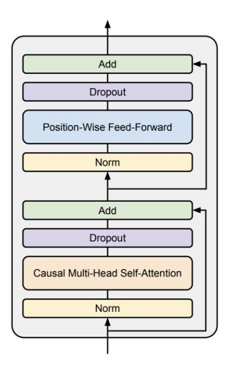

Could we parallelize the transformer block?

{27}------------------------------------------------

## **Parallel layers**

A few models (GPTJ, PaLM, GPT-NeoX) do parallel layers. Originally in GPT-J

$$y = x + \text{MLP}(\text{LayerNorm}(x + \text{Attention}(\text{LayerNorm}(x))))$$

$$y = x + \text{MLP}(\text{LayerNorm}(x)) + \text{Attention}(\text{LayerNorm}(x))$$

If implemented right, LayerNorm can be shared, and matrix multiplies can be fused

**Recent Models:** Cohere Command A, Falcon 2 11B, Command R+

{28}------------------------------------------------

## **Summary: architectures**

#### **Pre-vs-post norm:**

• Everyone does non-residual norm (except OPT350M), likely with good reason.

#### **Layer vs RMSnorm:**

• RMSnorm has clear compute wins, sometimes even performance

#### **Gating:**

• GLUs are consensus now

#### **Serial vs parallel layers:**

• Most models now use serial layers

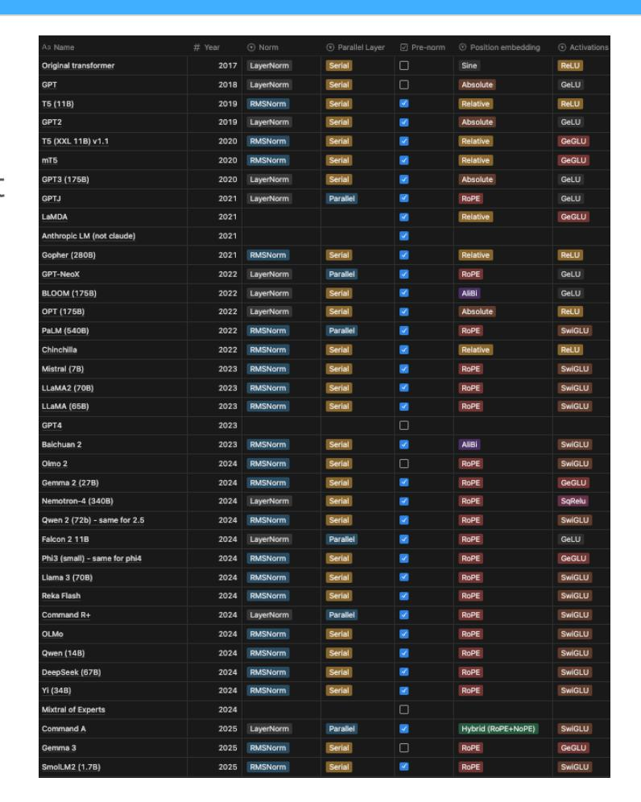

{29}------------------------------------------------

## **Many variations in position embeddings**

**Sine embeddings:** add sines and cosines that enable localization

**Notable models:**

$$Embed(x,i) = v_x + PE_{pos}$$

$$PE_{(pos,2i)} = sin(pos/10000^{2i/d_{\text{model}}})$$
 
$$PE_{(pos,2i+1)} = cos(pos/10000^{2i/d_{\text{model}}})$$

Original transformer

**Absolute embeddings:** add a position vector to the embedding

$$Embed(x,i) = v_x + u_i$$

**Notable models:**

GPT1/2/3, OPT

**Notable models:**

**Relative embeddings:** add a vector to the *attention computation*

$$e_{ij} = \frac{x_i W^Q (x_j W^K + a_{ij}^K)^T}{\sqrt{d_z}}$$

**Notable models:** 

GPTJ, PaLM, LLaMA *Most 2024+ models*

T5, Gopher, Chinchilla

**Rope embeddings** (next slides..)

{30}------------------------------------------------

## **RoPE: rotary position embeddings**

**High level thought process:** a *relative* position embedding should be some (, ) s.t.

$$\langle f(x,i), f(y,j) \rangle = g(x,y,i-j)$$

That is, the attention function *only* gets to depend on the relative position (i-j). How do existing embeddings not fulfill this goal?

- **Sine:** Has various cross-terms that are not relative , , , = , + , …
- **Absolute:** obviously not relative
- **Relative embeddings:** is not an inner product

{31}------------------------------------------------

## **RoPE: rotary position embeddings**

#### **How can we solve this problem?**

- We want our embeddings to be invariant to absolute position
- We know that inner products are invariant to arbitrary rotation.

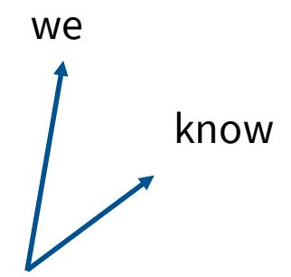

Position independent embedding

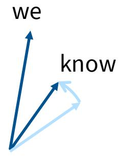

Embedding "we know that"

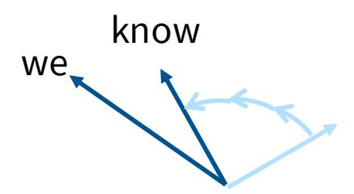

Embedding "of course we know"

Rotate we by '0 positions' Rotate we by '2 positions' know by '1 positions' Rotate know by '3 positions'

{32}------------------------------------------------

## **RoPE: rotary position embeddings**

#### **There are many rotations, which one do you pick?**

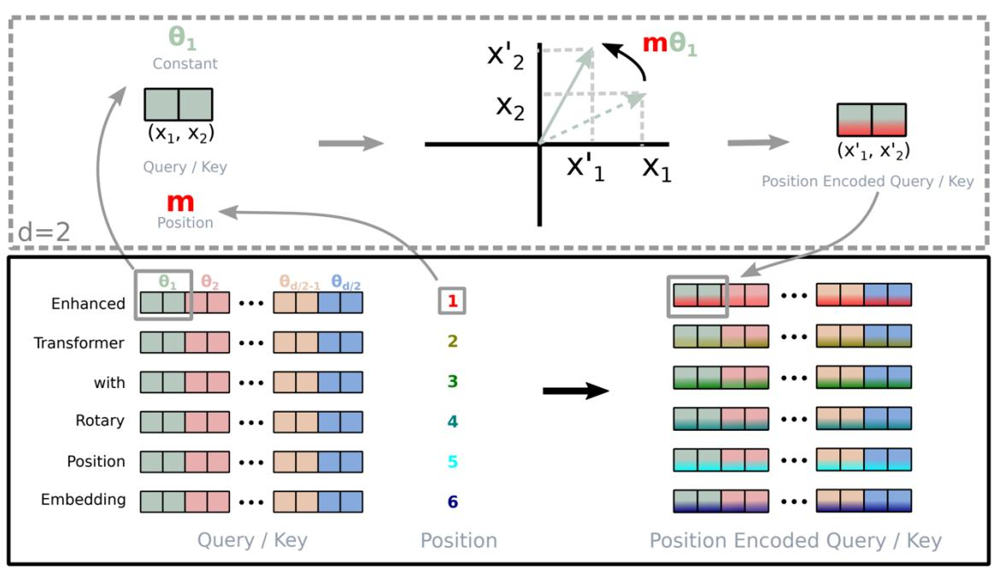

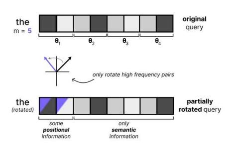

Gemma 4 alternative: just first 2

[Su et al 2021]

Just pair up the coordinates and rotate them in 2d (motivation: complex numbers)

{33}------------------------------------------------

## **The actual RoPE math**

Multiply with sines and cosines

$$f_{\{q,k\}}(\boldsymbol{x}_m, m) = \boldsymbol{R}_{\Theta,m}^d \boldsymbol{W}_{\{q,k\}} \boldsymbol{x}_m$$
(14)

$$\mathbf{R}_{\Theta,m}^{d} = \begin{pmatrix} \cos m\theta_{1} & -\sin m\theta_{1} & 0 & 0 & \cdots & 0 & 0\\ \sin m\theta_{1} & \cos m\theta_{1} & 0 & 0 & \cdots & 0 & 0\\ 0 & 0 & \cos m\theta_{2} & -\sin m\theta_{2} & \cdots & 0 & 0\\ 0 & 0 & \sin m\theta_{2} & \cos m\theta_{2} & \cdots & 0 & 0\\ \vdots & \vdots & \vdots & \vdots & \ddots & \vdots & \vdots\\ 0 & 0 & 0 & 0 & \cdots & \cos m\theta_{d/2} & -\sin m\theta_{d/2}\\ 0 & 0 & 0 & \cdots & \sin m\theta_{d/2} & \cos m\theta_{d/2} \end{pmatrix}$$
(15)

Difference with sine embeddings – not additive, no cross terms

{34}------------------------------------------------

## **Implementation and code for RoPE**

```
…
                           Same stuff as the usual multi-head self attention below
Get the RoPE
matrix cos/sin
Multiply 
query/key inputs
Usual 
attention stuff
```

**Note:** embedding at *each attention operation* to enforce position invariance

{35}------------------------------------------------

## **Hyperparameters**

#### **Transformer hyperparameter questions you might have had in 224n..**

- How much bigger should the feedforward size be compared to hidden size?
- How many heads, and should num\_heads always divide hidden size?
- What should my vocab size be?

#### And other model setting questions

- Do people even regularize these huge LMs?
- How do people scale these models very deep or very wide?

{36}------------------------------------------------

## **Surprising (?) consensus hyperparameter 1**

Feedforward – model dimension ratio.

$$\mathrm{FFN}(x) = \max(0, xW_1 + b_1)W_2 + b_2$$

There are two dimensions that are relevant – the feedforward dim () and model dim (). What should their relationship be?

$$d_{ff} = 4 \ d_{model}$$

This is *almost always* true. There's just a few exceptions.

{37}------------------------------------------------

## **Exception #1 – GLU variants**

Remember that GLU variants scale down by 2/3rd. This means most GLU variants have = 8 3 . This is mostly what happens. Some notable such examples.

| Model           | 𝒅<br>/𝒅<br>𝒇𝒇<br>𝒎𝒐𝒅𝒆𝒍 |
|-----------------|------------------------|
| PaLM            | 4                      |
| Mistral 7B      | 3.5                    |
| LLaMA-2 70B     | 3.5                    |
| LLaMA<br>70B    | 2.68                   |
| Qwen<br>14B     | 2.67                   |
| DeepSeek<br>67B | 2.68                   |
| Yi 34B          | 2.85                   |
| T5 v1.1         | 2.5                    |

Models are roughly in this range, though PaLM, LLaMA2 and Mistral are slightly larger

{38}------------------------------------------------

## **Exception #2 – T5**

As we have (and will) see, most LMs are have boring, conservative hyperparameters. One exception is T5 [Raffel et al 2020] which has some *very bold* settings.

In particular, for the 11B model, they set

$$d_{ff} = 65,536$$
  
 $d_{model} = 1024$ 

For an astounding 64-times multiplier.

Other, recent exceptions – Gemma 2 (8x), SmolLM/Gemma 3/Gemma 4 (4x, GLU)

{39}------------------------------------------------

## **Why this range of multipliers?**

Empirically, there's a basin between 1-10 where this hyperparameter is near-optimal

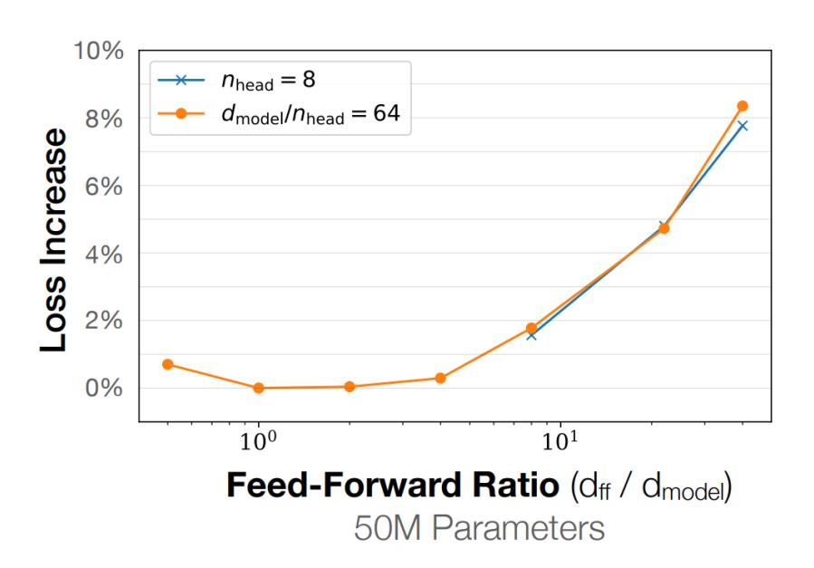

{40}------------------------------------------------

## **What can we learn from the model-dim hyperparam?**

• The 'default' choices of = 4 and = 2.66 have worked well for nearly all modern LLMs.

• But T5 does show that even radical choices of = 64 can work. This hyperparameter choice isn't written in stone.

• That said, T5 has a follow-up model (T5 v1.1) that is 'improved' and uses a much more standard 2.5 multiplier on GeGLU, so the 64-times multiplier is likely suboptimal.

{41}------------------------------------------------

## **Surprising (?) consensus hyperparameter 2**

Head-dim\*num-heads to model-dim ratio. As a reminder, slide from 224n.

This doesn't *have to* be true: we can have head-dimensions > model-dim / num-heads.

But most models do follow this guideline

{42}------------------------------------------------

## **How many heads, whats the model dim?**

Some examples of this hyperparameter

|                | Num heads | Head dim | Model dim | Ratio |
|----------------|-----------|----------|-----------|-------|
| GPT3           | 96        | 128      | 12288     | 1     |
| T5             | 128       | 128      | 1024      | 16    |
| T5 v1.1        | 64        | 64       | 4096      | 1     |
| LaMDA          | 128       | 128      | 8192      | 2     |
| PaLM           | 48        | 258      | 18432     | 1.48  |
| LLaMA2         | 64        | 128      | 8192      | 1     |
| Qwen 3.5 (27B) | 24        | 256      | 5120      | 1.2   |

Most models have ratios around 1 – notable exceptions by some google models.

{43}------------------------------------------------

## **Aspect ratios**

Should my model be deep or wide? *How* deep and how wide?

Most models are surprisingly consistent on this one too!

|             | Model                               | 𝒅<br>/𝒏<br>𝒎𝒐𝒅𝒆𝒍<br>𝒍𝒂𝒚𝒆𝒓 |
|-------------|-------------------------------------|---------------------------|
|             | BLOOM                               | 205                       |
|             | T5 v1.1                             | 171                       |
|             | PaLM<br>(540B)                      | 156                       |
| Sweet spot? | GPT3/OPT/Mistral/Qwen<br>/OLMo<br>3 | 128                       |
|             | LLaMA<br>/ LLaMA2                   | 102                       |
|             | Gemma 3                             | 87                        |
|             | Gemma 4                             | 61                        |
|             | T5 (11B)                            | 33                        |

{44}------------------------------------------------

## **Considerations about aspect ratio**

#### **Extremely deep models are harder to parallelize and have higher latency**

[Tay et al 2021]

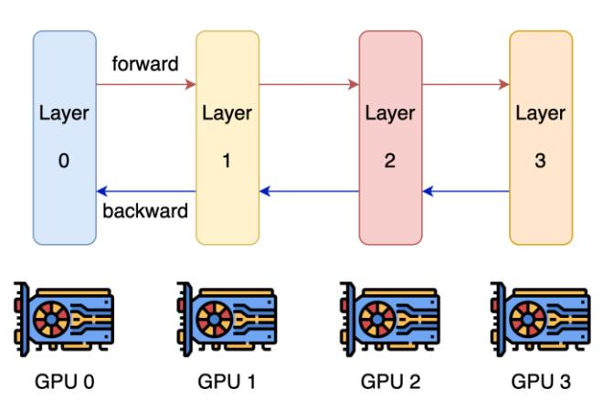

{45}------------------------------------------------

## **Evidence on aspect ratio scaling**

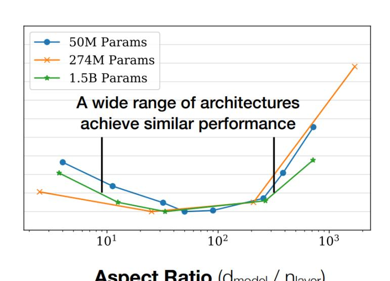

{46}------------------------------------------------

## **What are typical vocabulary sizes?**

Monolingual models – 30-50k vocab

| Model                   | Token count |
|-------------------------|-------------|
| Original<br>transformer | 37000       |
| GPT                     | 40257       |
| GPT2/3                  | 50257       |
| T5/T5v1.1               | 32128       |
| LLaMA                   | 32000       |

Multilingual / production systems 100-250k

| Model       | Token count |
|-------------|-------------|
| mT5         | 250000      |
| PaLM        | 256000      |
| GPT4        | 100276      |
| Gemma 4     | 262144      |
| DeepSeek    | 100000      |
| Qwen<br>15B | 152064      |
| Yi          | 64000       |

Monolingual vocabs don't need to be huge, but multilingual ones do

{47}------------------------------------------------

## **Dropout and other regularization**

Do we need regularization during pretraining?

#### **Arguments against:**

- There is *a lot* of data (trillions of tokens), more than parameters.
- SGD only does a single pass on a corpus (hard to memorize)

This is all quite reasonable.. but what do people do in practice?

{48}------------------------------------------------

## **Dropout and weight decay in practice**

| Model                | Dropout* | Weight decay |
|----------------------|----------|--------------|
| Original transformer | 0.1      | 0            |
| GPT2                 | 0.1      | 0.1          |
| T5                   | 0.1      | 0            |
| GPT3                 | 0.1      | 0.1          |
| T5 v1.1              | 0        | 0            |
| PaLM                 | 0        | (variable)   |
| OPT                  | 0.1      | 0.1          |
| LLaMA                | 0        | 0.1          |
| Qwen<br>14B          | 0.1      | 0.1          |

Many older models used dropout during pretraining

Newer models (except Qwen) rely only on weight decay

<sup>\*</sup> Most of the times papers just don't discuss dropout. On open models, this closely matches not doing dropout. This may not be true of closed models.

{49}------------------------------------------------

## **Why weight decay LLMs?**

[Andriushchenko et al 2023] has interesting observations about LLM weight decay

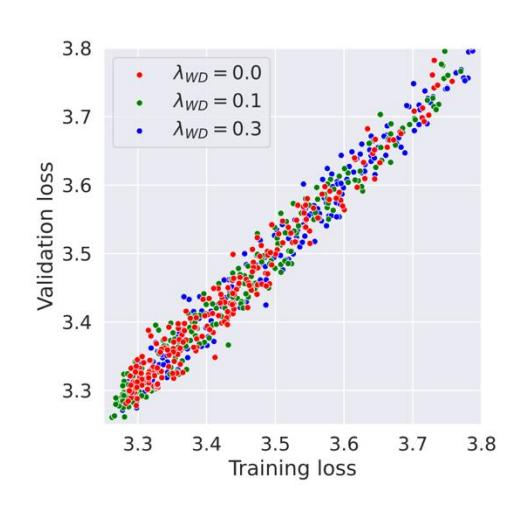

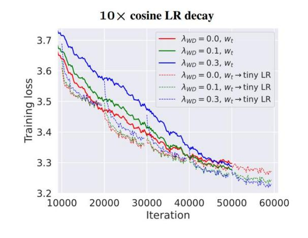

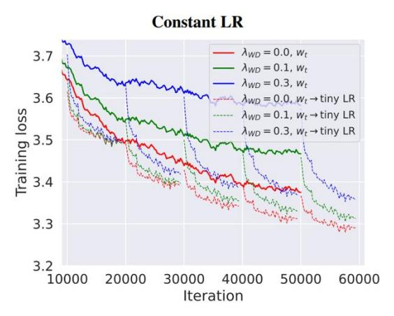

It's not to control overfitting Weight decay interacts with learning rates (cosine schedule)

{50}------------------------------------------------

## **Summary: hyperparameters**

#### **Feedforward**

• Factor-of-4 rule of thumb (8/3 for GLUs) is standard (with some evidence)

#### **Head dim**

• Head dim\*Num head = D model is standard – but low to no validation

#### **Aspect ratio**

• Wide range of 'good' values (100-200). Systems concerns dictate the value

#### **Regularization**

• You still 'regularize' LMs but its effects are primarily on optimization dynamics

| Original tra |
|--------------|
| GPT          |
| T5 (11B)     |
| GPT2         |
| T5 (XXL 11   |
| mT5          |
| GPT3 (175    |
| GPTJ         |
| LaMDA        |
| Anthropic I  |
| Gopher (28   |
| GPT-NeoX     |
| BLOOM (12    |
| OPT (1758    |
| PaLM (540    |
| Chinchilla   |
| Baichuan 2   |
| Mistral (7B  |
| LLaMA2 (7    |
| LLaMA (65    |
| GPT4         |
| Olmo 2       |
| Gemma 2 (    |
| Nemotron-    |
| Qwen 2 (72   |
| Falcon 2 1   |
| Phi3 (small  |
| Llama 3 (7   |
| Reka Flash   |
| Command      |
| OLMo         |
| Qwen (148    |
| DeepSeek     |
| Yi (34B)     |
| Mixtral of E |
| Command      |
| Gemma 3      |
| SmolLM2 (    |

| al transformer                      |  |
|-------------------------------------|--|
|                                     |  |
| IB)                                 |  |
|                                     |  |
| (L 11B) v1.1                        |  |
|                                     |  |
| (175B)                              |  |
|                                     |  |
| A.                                  |  |
| opic LM (not claude)                |  |
| er (280B)                           |  |
| leoX                                |  |
| M (175B)                            |  |
| 175B)                               |  |
| (540B)                              |  |
| hilla                               |  |
| Jan 2                               |  |
| l (7B)                              |  |
| A2 (70B)                            |  |
| (65B)                               |  |
|                                     |  |
| 2                                   |  |
| a 2 (27B)                           |  |
| tron-4 (340B)                       |  |
| 2 (72b) - same for 2.5              |  |
| 12 11B                              |  |
| small) - same for phi4              |  |
| 3 (70B)                             |  |
| lash                                |  |
| and R+                              |  |
|                                     |  |
|                                     |  |
| (148)                               |  |
| Seek (67B)                          |  |
| eek (678)<br>B)                     |  |
| eek (678)<br>B)                     |  |
| ieek (67B)<br>B)<br>I of Experts    |  |
| (14B) leek (67B) lof Experts land A |  |

| 2019 |  |
|------|--|
| 2019 |  |
| 2020 |  |
| 2020 |  |
| 2020 |  |
| 2021 |  |
| 2021 |  |
| 2021 |  |
| 2021 |  |
| 2022 |  |
| 2022 |  |
| 2022 |  |
| 2022 |  |
| 2022 |  |
| 2023 |  |
| 2023 |  |
| 2023 |  |
| 2023 |  |
| 2023 |  |
| 2024 |  |
| 2024 |  |
| 2024 |  |
| 2024 |  |
| 2024 |  |
| 2024 |  |
| 2024 |  |
| 2024 |  |
| 2024 |  |
| 2024 |  |
| 2024 |  |
| 2024 |  |
| 2024 |  |
| 2024 |  |
| 2025 |  |
| 2025 |  |
|      |  |

| 4        |
|----------|
| 2.5      |
| 2.5      |
|          |
|          |
|          |
|          |
|          |
|          |
|          |
|          |
|          |
|          |
| 2.68     |
| 3.5      |
| 3.5      |
| 2.6875   |
|          |
| 2.6875   |
|          |
|          |
| 3.609    |
|          |
| 3.5      |
| 3.5      |
|          |
| 2.75     |
| 2.6875   |
| 2.675    |
| 2.6875   |
| 2.857142 |
|          |
|          |
|          |

| 43  |  |
|-----|--|
| 33  |  |
| 171 |  |
| 171 |  |
| 128 |  |
| 146 |  |
| 128 |  |
| 128 |  |
| 205 |  |
| 140 |  |
| 205 |  |
| 128 |  |
| 156 |  |
| 102 |  |
| 128 |  |
| 128 |  |
| 102 |  |
| 102 |  |
|     |  |
| 128 |  |
| 100 |  |
| 192 |  |
| 102 |  |
| 68  |  |
| 128 |  |
| 102 |  |
|     |  |
| 192 |  |
| 128 |  |
| 128 |  |
| 86  |  |
| 119 |  |
|     |  |
|     |  |
| 87  |  |

| 43  |      |  |
|-----|------|--|
| 33  | 0.1  |  |
| 171 |      |  |
| 171 |      |  |
| 128 | 0.1  |  |
| 146 | 0.1  |  |
| 128 |      |  |
| 128 |      |  |
| 205 |      |  |
| 140 | 0.01 |  |
| 205 | 0.1  |  |
| 128 | 0.1  |  |
| 156 |      |  |
| 102 |      |  |
| 128 | 0.1  |  |
| 128 | 0.1  |  |
| 102 | 0.1  |  |
| 102 | 0.1  |  |
|     |      |  |
| 128 |      |  |
| 100 |      |  |
| 192 |      |  |
| 102 |      |  |
| 68  | 0.1  |  |
| 128 |      |  |
| 102 |      |  |
|     |      |  |
| 192 |      |  |
| 128 | 0.1  |  |
| 128 | 0.1  |  |
| 86  | 0.1  |  |
| 119 | 0.1  |  |
|     |      |  |
|     |      |  |
| 97  |      |  |

{51}------------------------------------------------

## **Stability tricks**

Recently, lots of attention on *stable training*

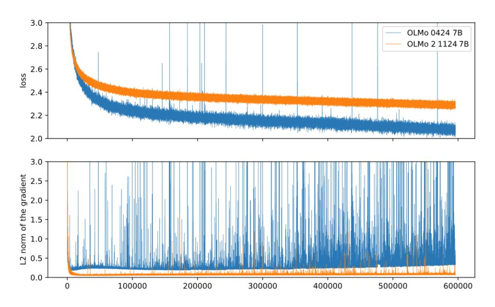

Don't train models that look like the blue curve!

{52}------------------------------------------------

## **Where do the issues arise? Beware of softmaxes!**

**Softmaxes** – can be ill-behaved due to exponentials / divison by zero

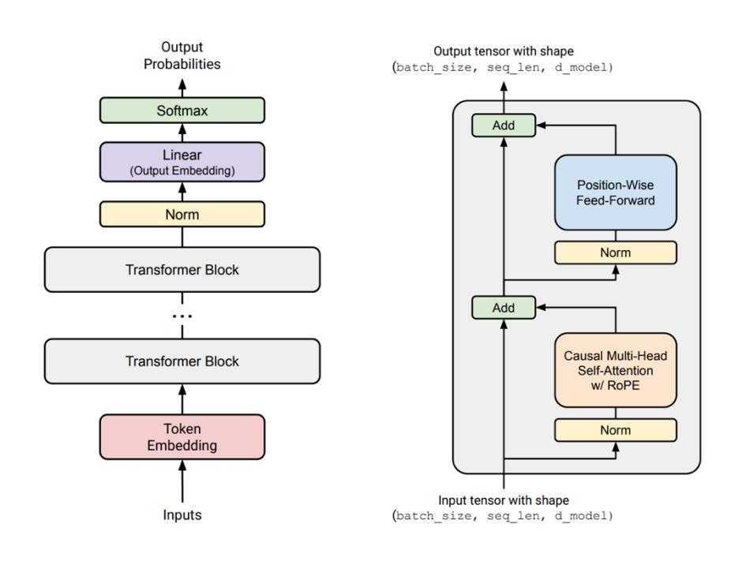

{53}------------------------------------------------

## **Output softmax stability – the 'z-loss'**

#### Recall the softmax calculation

$$\log(P(x)) = \log\left(\frac{e^{U_r(x)}}{Z(x)}\right)$$
$$= U_r(x) - \log(Z(x))$$
$$Z(x) = \Sigma_{r'=1}^{|V|} e^{U_{r'}(x)}$$

$$L = \sum_{i} \left[ \log(P(x_i)) - \alpha(\log(Z(x_i)) - 0)^2 \right]$$
$$= \sum_{i} \left[ \log(P(x_i)) - \alpha \log^2(Z(x_i)) \right]$$

[From Devlin 2014]

This is useful for stability! PaLM used this 'z loss' trick.

**Other examples:** Baichuan 2 (2023), DCLM (2024), OLMo 2 (2025), OLMo 3 (2025)

{54}------------------------------------------------

## **Attention softmax stability – the 'QK norm'**

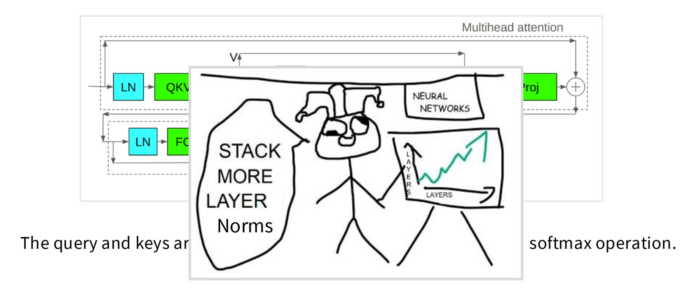

**Other examples: DCLM, OLMo2, Gemma 2, Qwen3, OLMo 3, Gemma 4**

Originally from vision and multimodal models [Dehgani 2023, Idefcs, Chameleon]

{55}------------------------------------------------

## **Logit soft-capping.**

#### **Soft-capping** the logits to some maximum value via Tanh

#### Prevents logits from blowing up, but also might have perf issues?

|               |          | 1 7      |             |         |            |
|---------------|----------|----------|-------------|---------|------------|
| bf16 baseline | soft_cap | QKV_norm | QK_norm_cap | QK_norm | QK_FC_norm |
| 11.19         | 11.24    | 10.85    | 11.00       | 10.84   | 10.87      |

{56}------------------------------------------------

## **Attention heads**

Most models don't touch the attention heads much at all with a few minor exceptions..

**GQA / MQA** : Saving inference costs by reducing the number of heads

**Sparse or sliding window attention (GPT4/Mistral):** restricting the attention pattern to reduce compute cost

**Exotic SSM stuff (Jamba, Falcon 3, Qwen 3.5, etc):** next lecture!

{57}------------------------------------------------

## **GQA/MQA – Reducing attention head cost**

#### **Let's think about the compute involved for attention**

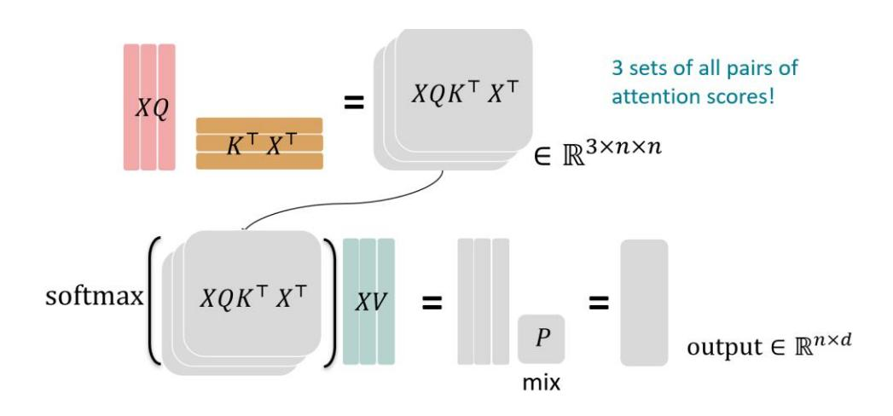

d = hidden dim b = batch n = length (<d) h = heads k = head dim (d/h)

**Total arithmetric operations** ( 2 ), **total memory accesses** ( + ℎ <sup>2</sup> + 2 ) X softmax projection

Arithmetic intensity (compute/memory) is high 
$$O\left(\left(\frac{1}{k} + \frac{1}{bn}\right)^{-1}\right)$$
 - we can keep our GPUs running

{58}------------------------------------------------

## **GQA/MQA – Reducing attention head cost**

What about the *incremental* case when we generate text?

**Key difference:** can't parallelize the generation process – needs to be step by step

In this case – we need to incrementally re-compute/update attention via the 'KV cache'

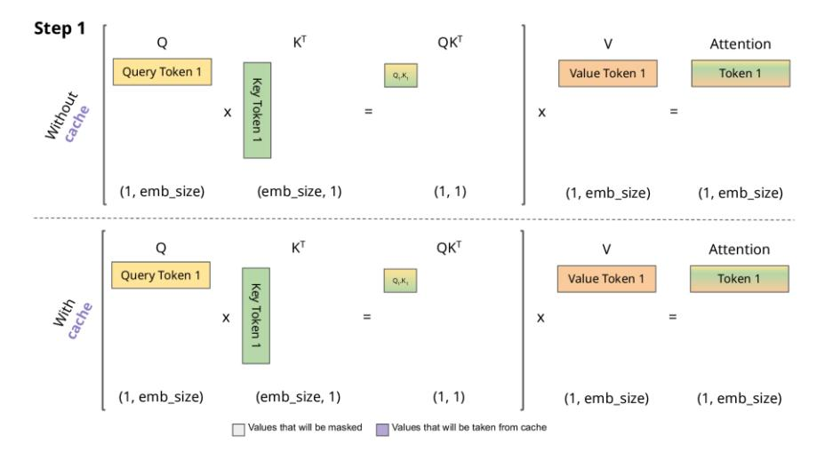

{59}------------------------------------------------

## **GQA/MQA – Reducing attention head cost**

What's the incremental arithmetic intensity?

Total arithmetric operations 
$$(bnd^2)$$
, total memory accesses  $(bn^2d+nd^2)$ 

Arithmetic intensity is not good 
$$O\left(\left(\frac{n}{d} + \frac{1}{b}\right)^{-1}\right)$$
 - need large batches + short seq length (n) or big model dimensions (d)

Is there some way around this? The n/d term is difficult to reduce.

{60}------------------------------------------------

## **MQA – just have fewer key dimensions.**

**Key idea** – have multiple queries, but just one dimension for keys and values

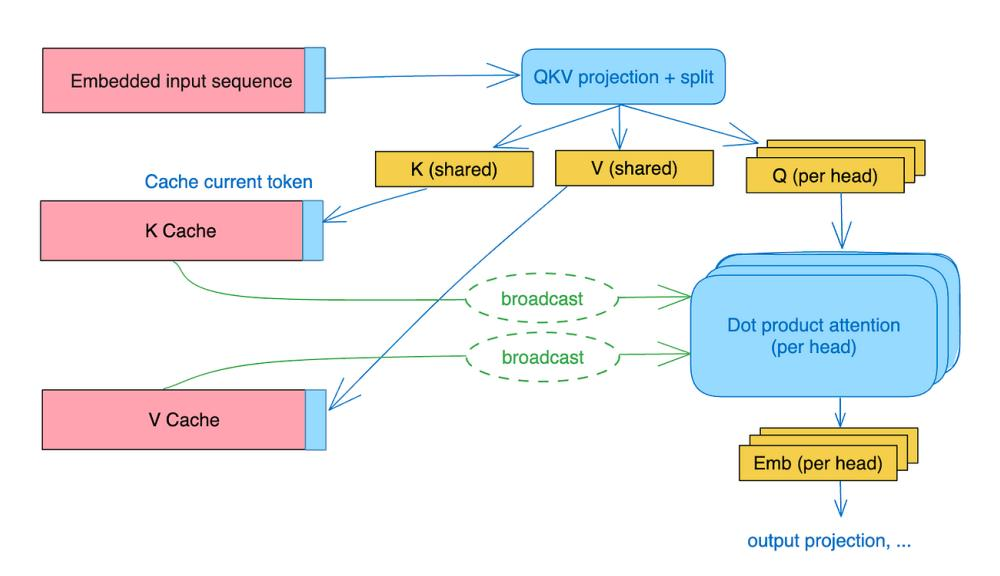

We have much fewer items to move in and out of memory (KV Cache)

Total memory access 
$$(bnd+bn^2k+nd^2)$$
, Arithmetic intensity  $O\left(\left(\frac{1}{d}+\frac{n}{dh}+\frac{1}{b}\right)^{-1}\right)$ 

{61}------------------------------------------------

## **Additional extensions – GQA**

Don't go all the way to one dimension of KV – have fewer dims

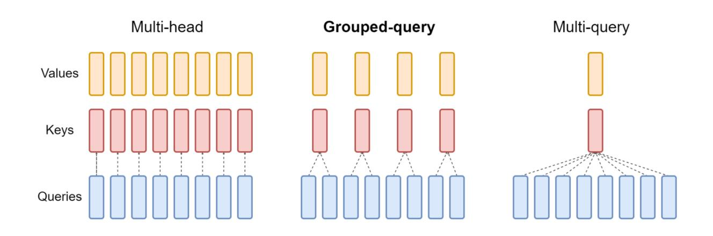

Simple knob to control expressiveness (key-query ratio) and inference efficiency

**More recently –** MLA (multihead latent attention) from deepseek v2

{62}------------------------------------------------

## **Does MQA hurt? Sometimes..**

| Attention   | h      | $d_k, d_v$ | $d_{ff}$ | dev-PPL |
|-------------|--------|------------|----------|---------|
| multi-head  | 8      | 128        | 8192     | 29.9    |
| multi-query | 8      | 128        | 9088     | 30.2    |
| multi-head  | 1      | 128        | 9984     | 31.2    |
| multi-head  | $^{2}$ | 64         | 9984     | 31.1    |
| multi-head  | 4      | 32         | 9984     | 31.0    |
| multi-head  | 8      | 16         | 9984     | 30.9    |

#### Small PPL hit w/ MQA [Shazeer 2019] Low/no hit w/ GQA [Ainslie 2023]

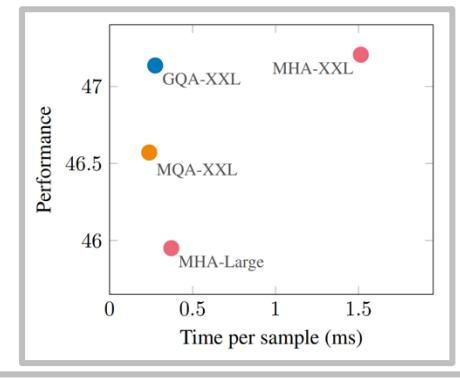

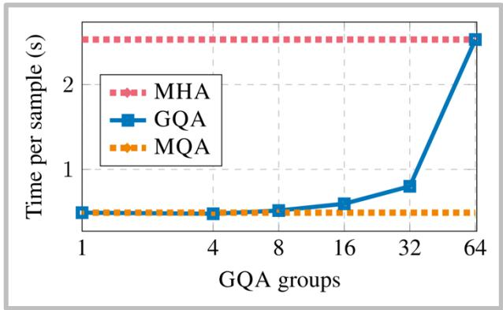

{63}------------------------------------------------

## **Sparse / sliding window attention**

**Attending to the entire context can be expensive (quadratic).** 

Build sparse / structured attention that trades off expressiveness vs runtime (GPT3, GPT-OSS, Gemma4)

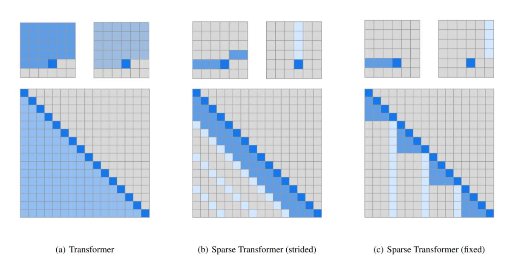

{64}------------------------------------------------

## **Current standard trick – interleave 'full' and 'LR' attention**

From Cohere Command A – Every 4th layer is a full attention

| Tokenizer - M    | cabulary size : 255,000<br>ultilingual<br>pecial tokens for chat turns, t | ool calls.                                        |              | Command A Transform                                                   | mer Block (SWA)                        |
|------------------|---------------------------------------------------------------------------|---------------------------------------------------|--------------|-----------------------------------------------------------------------|----------------------------------------|
| Input            | embeddings                                                                |                                                   | 1            | Sliding Window                                                        | MLP                                    |
| Transformer Bloc | C 1 Self-Attention (SWA)                                                  | MLP                                               |              | Self-Attention - Grouped-query attention - RoPE positional embeddings | - SwiGLU activation<br>- No bias terms |
| Transformer Bloc | < 2 Self-Attention (SWA)                                                  | MLP                                               | 8            |                                                                       |                                        |
| Transformer Bloc | Self-Attention (SWA)                                                      | MLP                                               | mpeddin      |                                                                       |                                        |
| Transformer Bloc | C 4 Self-Attention (Full)                                                 | MLP                                               | and output   | Command A Transform                                                   | mer Block (Full)                       |
|                  | ***                                                                       | Interleaved SWA and<br>full attention (3:1 ratio) | Shared Input | Full                                                                  | MLP                                    |
| Transformer Bloc | Self-Attention (Full)                                                     | MLP                                               |              | Self-Attention - Grouped-query attention - No positional embeddings   | - SwiGLU activation<br>- No bias terms |
|                  |                                                                           |                                                   |              |                                                                       |                                        |

Long-range info via NoPE, short-range info via RoPE + SWA.

**Other models –** LLaMA 4, Gemma 3, Gemma 4, OLMo 3 does SWA+Full RoPE.

{65}------------------------------------------------

## **Other recent examples of interleaved attention**

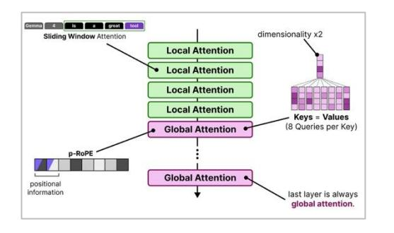

| Gradient clipping          | 1.0                           |
|----------------------------|-------------------------------|
| Z-loss weight              | $10^{-5}$                     |
| Weight decay on embeddings | No                            |
| Sliding window attention   | 3/4 of layers; $4,096$ tokens |
| RoPE scaling               | YaRN on full attn. layers     |
| RoPE $\theta$              | $5 \cdot 10^5$                |
| Layer norm applied to      | Outputs                       |

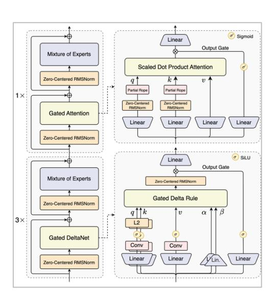

Gemma 4 Olmo 3 Qwen 3.5 / Qwen 3 Next

{66}------------------------------------------------

## **Recap, conclusion, etc.**

Many aspects (arch, hparams) of transformers are in common across the big LMs

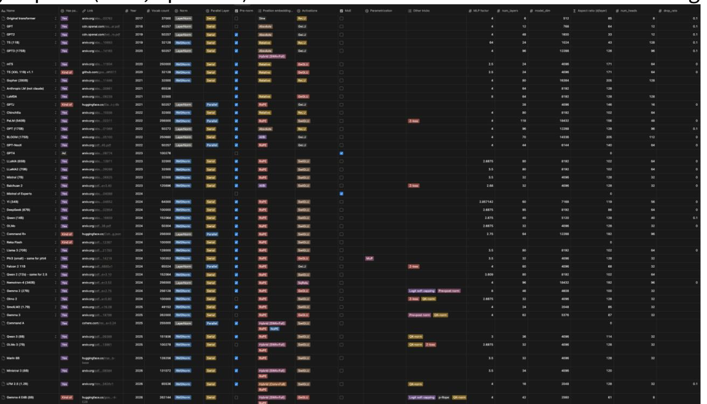

Major differences? Position embeddings, activations, tokenization